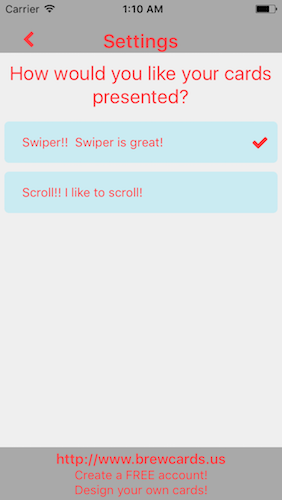

# BrewCards

- React-Native app for http://www.brewcards.us/
- Redux
- Follow the link above on a desktop to make cards
- Follow the links below to grab the mobile app

| iTunes | Google Play|
| --- | ---|
|  ||

*I'm a developer, not a designer*

 
 

